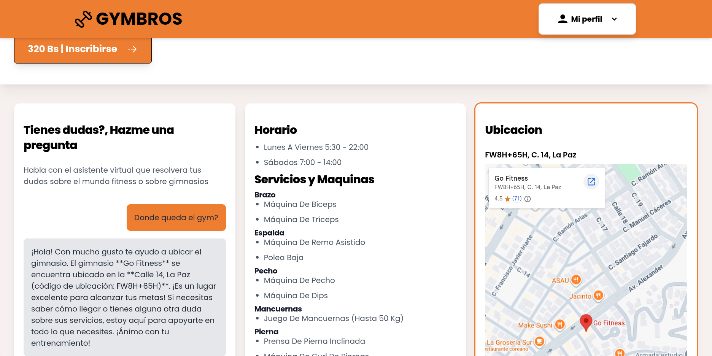
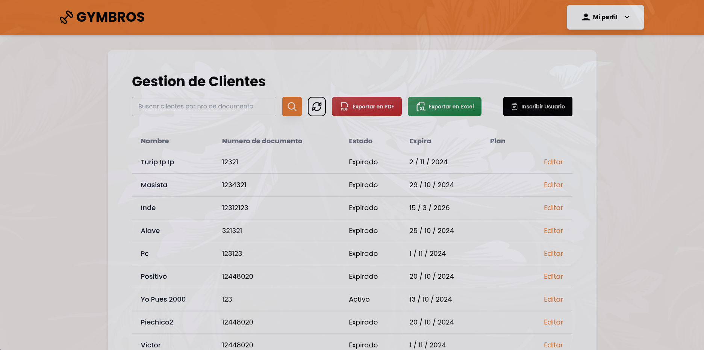
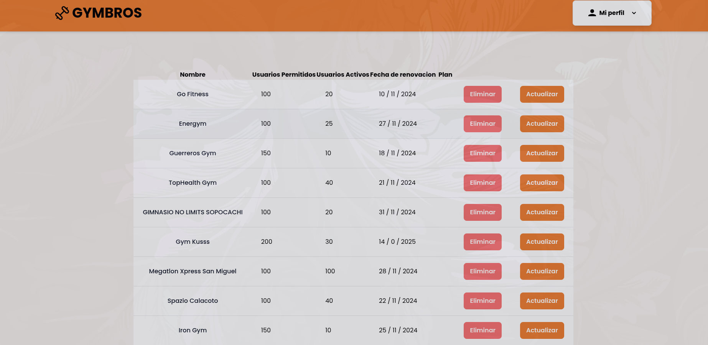

# Gymbros 🏋️

A web platform for gym discovery and membership management, featuring role-based dashboards and AI-powered chatbot

🔗 **Live Demo:** https://gymbros-web-u.vercel.app

---

## 📸 Screenshots

### Home Page


### Gym Information View


### Profile


### Gym Clients View


### Gym List and Reports




<!-- Add screenshots here once available -->

---

## ✨ Features

### 👤 User
- Browse and explore registered gyms
- Sign up and manage personal profile

### 🛠️ Admin
- Manage gym member list
- Create and publish posts visible to gym members

### 👑 Owner
- View and manage all registered gyms
- Access gym performance reports
- Export data to Excel and PDF

You can access the different roles by using this accounts:
- Admin: -email admin@gmail.com -password admin1234
- Owner: -email owner@gmail.com -password owner1234

---

## 🔐 Authentication
- Email/password login and registration
- Role-based protected routes (user, admin, owner)
- Persistent session with Firebase Authentication

---

## 🛠️ Tech Stack

| Technology | Usage |
|---|---|
| React | UI framework |
| JavaScript | Core language |
| Tailwind CSS | Styling |
| Firebase Auth | Authentication |
| Firestore | Database |
| Firebase Storage | File storage |
| Zustand | State management |
| React Router | Client-side routing |
| Vite | Build tool |
| Chatbot | GeminiAPI |

---

## 📱 Mobile App
A companion mobile app built with **Expo & React Native** featuring AI-powered workout routine generation via the OpenAI API.
> Repo: https://github.com/Chesco216/gymbros-user-app

---

## 🚀 Getting Started

### Prerequisites
- Node.js 18+
- A Firebase project with Auth, Firestore and Storage enabled
- An GeminiAI API key (for the chatbot)
- An OpenAI API key (for the mobile app)

### Installation

```bash
git clone https://github.com/Chesco216/gymbros-web-u.git
cd gymbros-web-u
yarn
```

Create a `.env` file in the root with your Firebase config:

```env
VITE_FB_API_KEY=your_firebase_key
VITE_GEMINI_API_KEY=your_gemini_key
VITE_GPT_API_KEY=your_openai_key
```

```bash
yarn dev
```

---

